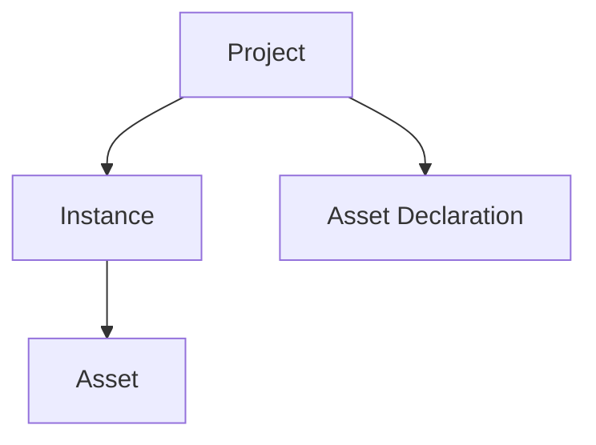

# MNC Project

This file describes what is MNC Project and contains specs of mnc.yml project file.

## Key Terms



```yaml
assets:
      # Allow to embed any kind of data
    - name: server.properties
      kind: embedded/v1
      spec:
        type: text # text, base64 (for binary data)
        content: |
          server-name=My Server
          server-port=25565
          server-allowlist=*
      # Allow to use any network resource
    - name: servers.dat
      kind: url/v1
      spec:
        url: https://example.com/servers.dat
      # Allow to download mohist server
      # API: https://mohistmc.com/mohistmc-api
    - name: server
      kind: mohist/v1
      spec:
        project: mohist
        version: 1.20.1
      # Allow to use any resource from modrinth
    - name: mod1
      kind: modrinth/mod/v1
      spec:
        id: ...
instances:
    client:
        assets:
            - name: servers.dat
              update: always # never, once, always, ifNotExists, ifChanged
              location: servers.dat
```

### Project

Project представляет собой директорию в корне которой находится файл mnc.yml.
Если вы знакомы с Font-End разработкой, то вы можете считать этот файл аналогом package.json,
или, если вы пишите на Go, то аналогом go.mod.

Обычно, файла проекта должно быть достаточно чтобы воссоздать полностью рабочие и настроенные
экземпляры Minecraft клиентов и серверов.

Файл проекта содержит описание всех зависимостей, включая моды, плагины, шейдеры и прочие объекты,
имеющие отношение к Minecraft.

### Instance

Каждый проект может иметь в своём составе несколько экземпляров Minecraft.
Экземпляр может быть клиентом или сервером.

Например, вы можете в рамках одного проекта управлять экземпляром клиента и экземпляром сервера.

### 
